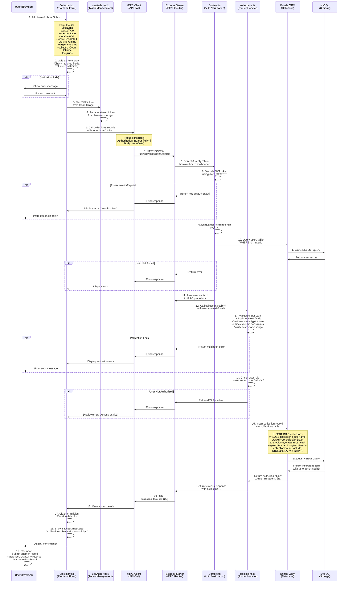
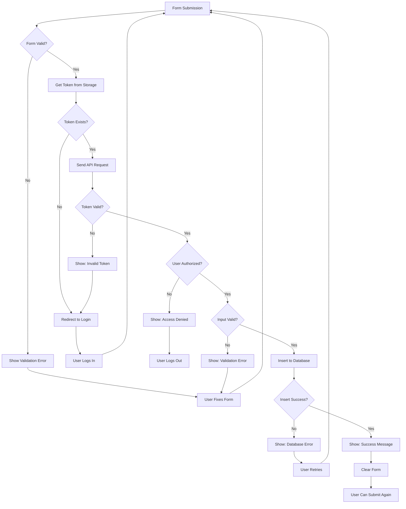

# Data Collection Process - Sequence Diagram

## Overview

This document illustrates the complete flow of waste collection data from form submission in the frontend through validation, authentication, API processing, and final storage in the database.

## Process Flow Diagram



## Detailed Component Interactions

### 1. Frontend Form Submission (Collector.tsx)

**File:** `client/src/pages/Collector.tsx` (Lines 62-90)

```typescript
const handleSubmit = async (e: React.FormEvent) => {
  e.preventDefault();
  setError("");
  setSuccess(false);

  try {
    // Call tRPC mutation with form data
    await submitMutation.mutateAsync({
      ...formData,
      latitude: parseFloat(formData.latitude as any),
      longitude: parseFloat(formData.longitude as any),
    });
    
    // Success: Clear form and show message
    setSuccess(true);
    setFormData({...}); // Reset
    setTimeout(() => setSuccess(false), 5000);
  } catch (err: any) {
    setError(err.message || "Failed to submit collection data");
  }
};
```

**Form Validation (Lines 53-60):**
```typescript
const handleInputChange = (e: React.ChangeEvent<HTMLInputElement | HTMLSelectElement>) => {
  const { name, value, type } = e.target;
  const finalValue = type === "checkbox" ? (e.target as HTMLInputElement).checked : value;
  setFormData((prev) => ({
    ...prev,
    [name]: name.includes("Volume") || name.includes("Count") ? parseFloat(value) : finalValue,
  }));
};
```

### 2. Authentication & Token Management (useAuth Hook)

**File:** `client/src/_core/hooks/useAuth.ts`

```typescript
// Token is stored in localStorage
const [token, setToken] = useState<string | null>(() => {
  if (typeof window === "undefined") return null;
  return localStorage.getItem("auth_token");
});

// Token is automatically included in all tRPC calls
// via the tRPC client configuration
```

### 3. tRPC Client Setup

**File:** `client/src/lib/trpc.ts`

```typescript
export const trpc = createTRPCReact<AppRouter>();
```

The tRPC client automatically:
- Retrieves token from localStorage
- Includes it in Authorization header
- Handles request/response serialization
- Manages error states

### 4. Backend Context & Authentication

**File:** `server/_core/context.ts`

```typescript
export async function createContext(
  opts: CreateExpressContextOptions
): Promise<TrpcContext> {
  let user: User | null = null;

  try {
    // Extract token from Authorization header
    const authHeader = opts.req.headers.authorization;
    const token = extractTokenFromHeader(authHeader);

    if (token) {
      // Verify token signature
      const payload = verifyToken(token);

      // Fetch user from database
      const db = await getDb();
      if (db) {
        const userResult = await db
          .select()
          .from(users)
          .where(eq(users.id, payload.userId))
          .limit(1);

        if (userResult.length > 0) {
          user = userResult[0];
        }
      }
    }
  } catch (error) {
    user = null;
  }

  return { req: opts.req, res: opts.res, user };
}
```

### 5. Collections Router - Submit Endpoint

**File:** `server/routers/collections.ts` (Lines 1-100+)

```typescript
export const collectionsRouter = router({
  submit: protectedProcedure
    .input(z.object({
      siteName: z.string().min(1),
      wasteType: z.enum(["Organic", "Inorganic", "Mixed"]),
      collectionDate: z.string(),
      totalVolume: z.number().min(0).max(999.99),
      wasteSeparated: z.boolean(),
      organicVolume: z.number().optional(),
      inorganicVolume: z.number().optional(),
      collectionCount: z.number().min(1),
      latitude: z.number().min(-90).max(90),
      longitude: z.number().min(-180).max(180),
    }))
    .mutation(async ({ ctx, input }) => {
      // ctx.user is automatically available (verified by protectedProcedure)
      
      const db = await getDb();
      if (!db) {
        throw new TRPCError({
          code: "INTERNAL_SERVER_ERROR",
          message: "Database connection failed",
        });
      }

      // Insert into database
      const result = await db.insert(collections).values({
        collectorId: ctx.user.id,
        siteName: input.siteName,
        wasteType: input.wasteType,
        collectionDate: new Date(input.collectionDate),
        totalVolume: input.totalVolume,
        wasteSeparated: input.wasteSeparated,
        organicVolume: input.organicVolume || null,
        inorganicVolume: input.inorganicVolume || null,
        collectionCount: input.collectionCount,
        latitude: input.latitude,
        longitude: input.longitude,
      });

      return {
        success: true,
        id: result[0],
        message: "Collection submitted successfully",
      };
    }),
});
```

### 6. Database Layer - Drizzle ORM

**File:** `drizzle/schema.ts`

```typescript
export const collections = mysqlTable("collections", {
  id: int("id").autoincrement().primaryKey(),
  collectorId: int("collectorId").notNull().references(() => users.id),
  siteName: varchar("siteName", { length: 255 }).notNull(),
  wasteType: mysqlEnum("wasteType", ["Organic", "Inorganic", "Mixed"]).notNull(),
  collectionDate: date("collectionDate").notNull(),
  totalVolume: decimal("totalVolume", { precision: 10, scale: 2 }).notNull(),
  wasteSeparated: boolean("wasteSeparated").default(false).notNull(),
  organicVolume: decimal("organicVolume", { precision: 10, scale: 2 }),
  inorganicVolume: decimal("inorganicVolume", { precision: 10, scale: 2 }),
  collectionCount: int("collectionCount").default(1).notNull(),
  latitude: decimal("latitude", { precision: 10, scale: 8 }),
  longitude: decimal("longitude", { precision: 11, scale: 8 }),
  createdAt: timestamp("createdAt").defaultNow().notNull(),
  updatedAt: timestamp("updatedAt").defaultNow().onUpdateNow().notNull(),
});
```

## Data Flow Summary

| Stage | Component | Action | Status |
|-------|-----------|--------|--------|
| 1 | User | Fills form with waste data | Input |
| 2 | Collector.tsx | Validates form fields | Validation |
| 3 | useAuth Hook | Retrieves JWT token | Authentication |
| 4 | tRPC Client | Sends POST with token | Request |
| 5 | Express Server | Receives request | Routing |
| 6 | Context.ts | Extracts & verifies token | Auth Check |
| 7 | Collections Router | Validates input schema | Validation |
| 8 | Collections Router | Checks user role | Authorization |
| 9 | Drizzle ORM | Builds INSERT query | Query Building |
| 10 | MySQL | Executes INSERT | Storage |
| 11 | Drizzle ORM | Returns inserted record | Response |
| 12 | Collections Router | Returns success | Response |
| 13 | tRPC Client | Receives response | Response |
| 14 | Collector.tsx | Shows success message | Feedback |
| 15 | User | Sees confirmation | Output |

## Error Handling Flow



## Key Security Points

1. **Token Verification** (Context.ts)
   - JWT signature verified using JWT_SECRET
   - Token expiration checked
   - Invalid tokens rejected with 401

2. **User Validation** (Context.ts)
   - User ID from token verified against database
   - Non-existent users rejected

3. **Role-Based Access** (Collections Router)
   - Only 'collector' and 'admin' roles allowed
   - Enforced via `protectedProcedure`

4. **Input Validation** (Collections Router)
   - Zod schema validates all fields
   - Type-safe enum for waste type
   - Numeric ranges enforced
   - Required fields checked

5. **SQL Injection Prevention** (Drizzle ORM)
   - Parameterized queries used
   - No string concatenation in SQL

## Performance Considerations

1. **Database Indexes**
   - `collectorId` indexed for fast user lookups
   - `collectionDate` indexed for filtering
   - `wasteType` indexed for analytics

2. **Token Caching**
   - Token stored in localStorage (client-side)
   - No need to fetch on every request
   - Expires after 24 hours

3. **Database Connection Pooling**
   - Connection reused across requests
   - Reduces connection overhead

## Testing the Flow

### Manual Testing Steps

1. **Start Application**
   ```bash
   pnpm dev
   ```

2. **Register New Collector**
   - Go to http://localhost:5173/register
   - Fill form with: name, email, password
   - Click "Create Account"

3. **Login**
   - Go to http://localhost:5173/login
   - Use registered email and password
   - Click "Sign In"

4. **Submit Collection**
   - Click "Submit Collection" button
   - Fill data collection form:
     - Site Name: "Test Site"
     - Waste Type: "Organic"
     - Collection Date: Today's date
     - Total Volume: 10.5
     - Waste Separated: Check
     - Organic Volume: 7.0
     - Inorganic Volume: 3.5
     - Collection Count: 1
     - Latitude: -0.3031
     - Longitude: 34.7616
   - Click "Submit Collection"

5. **Verify Success**
   - Should see: "Collection submitted successfully!"
   - Form should reset
   - Check `/my-records` to see submission
   - Check `/dashboard` to see data on map

### API Testing with curl

```bash
# 1. Register
curl -X POST http://localhost:3000/api/trpc/auth.register \
  -H "Content-Type: application/json" \
  -d '{
    "name": "Test Collector",
    "email": "test@example.com",
    "password": "password123"
  }'

# 2. Login
curl -X POST http://localhost:3000/api/trpc/auth.login \
  -H "Content-Type: application/json" \
  -d '{
    "email": "test@example.com",
    "password": "password123"
  }'
# Copy the token from response

# 3. Submit Collection
curl -X POST http://localhost:3000/api/trpc/collections.submit \
  -H "Content-Type: application/json" \
  -H "Authorization: Bearer YOUR_TOKEN_HERE" \
  -d '{
    "siteName": "Test Dumpsite",
    "wasteType": "Organic",
    "collectionDate": "2025-10-22",
    "totalVolume": 12.5,
    "wasteSeparated": true,
    "organicVolume": 8.5,
    "inorganicVolume": 4.0,
    "collectionCount": 1,
    "latitude": -0.3031,
    "longitude": 34.7616
  }'
```

## Conclusion

The data collection process is fully secured with:
- JWT token-based authentication
- Role-based access control
- Input validation at multiple layers
- Parameterized database queries
- Error handling and user feedback

All components work together to ensure data integrity, security, and user experience.

